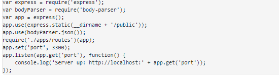
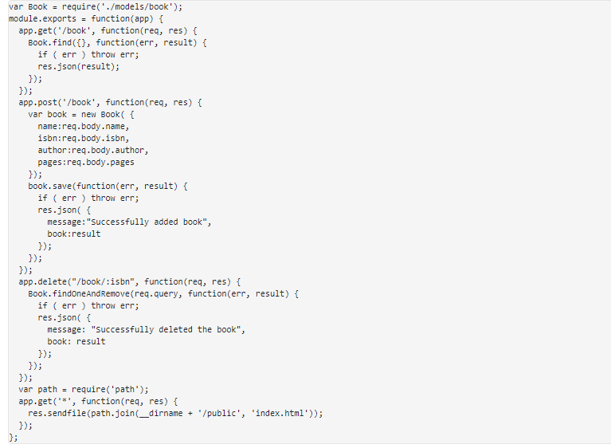
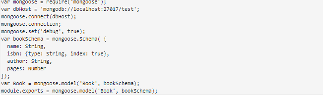
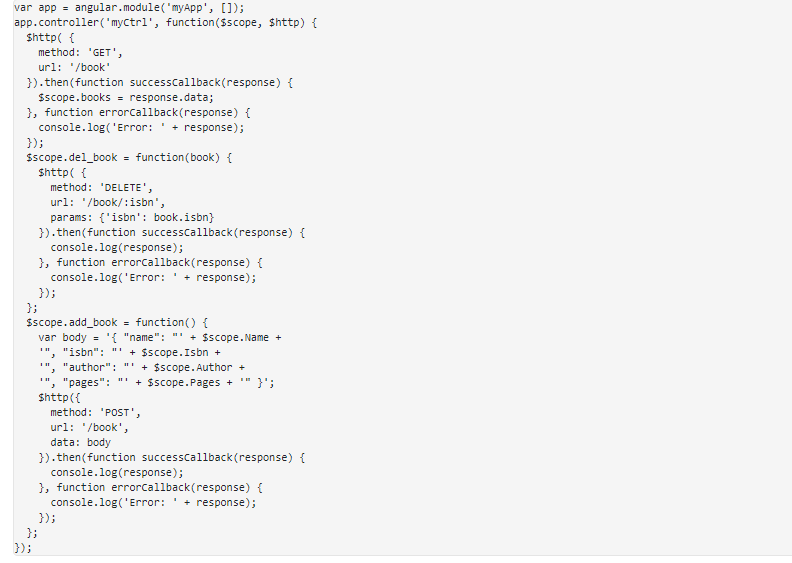
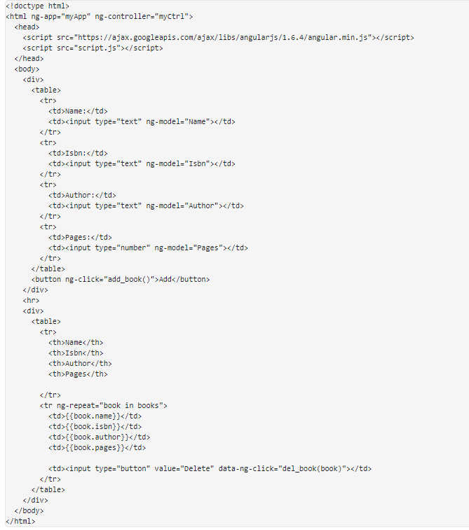
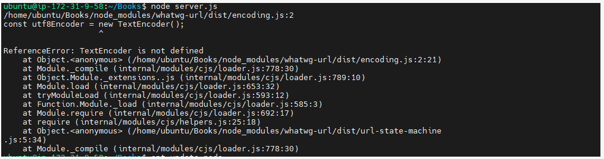
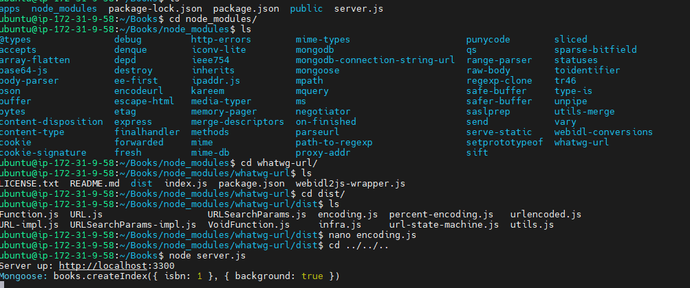

# MEAN STACK IMPLEMENTATION
### MEAN (MongoDB, ExpressJS, Angular, NodeJS)-It consists of following components:

-   MongoDB (Document database) – Stores and allows to retrieve data.
-   Express (Back-end application framework) – Makes requests to Database for Reads and Writes.
-   Angular (Front-end application framework) – Handles Client and Server Requests
-   Node.js (JavaScript runtime environment) – Accepts requests and displays results to end user

*MEAN Architecture*

#### Step 0 – Spun-off EC2 Linux Ubuntu Server and Applied basic configurations

Launched EC2 instance of Linux Ubuntu Server 20.04 LTS (HVM) and named it as pbl_p4_mean. Created security group with relevant ports opened and also created and saved my private key to be used for SSH into the EC2 instance.

*EC2 Instance Linux Ubuntu Server 20.04 1 CPU 8G Storage*

### Step 1: Install Node.js

Node.js is a JavaScript runtime built on Chrome’s V8 JavaScript engine. Node.js is used here to set up the Express routes and AngularJS controllers.

Update ubuntu

`sudo apt update`

Upgrade ubuntu

`sudo apt upgrade`

Install NodeJS

`sudo apt install -y nodejs`

*Node.js installation completed*

### Step 2: Install MongoDB

MongoDB stores data in flexible, JSON-like documents. Fields in a database can vary from document to document and data structure can be changed over time. In this app, book records are being added to MongoDB that contain book name, isbn number, author, and number of pages.

`sudo apt-key adv --keyserver hkp://keyserver.ubuntu.com:80 --recv 0C49F3730359A14518585931BC711F9BA15703C6`

`echo "deb [ arch=amd64 ] https://repo.mongodb.org/apt/ubuntu trusty/mongodb-org/3.4 multiverse" | sudo tee /etc/apt/sources.list.d/mongodb-org-3.4.list`

Install MongoDB

`sudo apt install -y mongodb`

Start The server

`sudo service mongodb start`

Verify that the service is up and running

`sudo systemctl status mongodb`

Install npm – Node package manager.

`sudo apt install -y npm`

Install body-parser package which helps to process JSON files passed in requests to the server.

`sudo npm install body-parser`

Created folder-Books

`mkdir Books && cd Books`

In the Books directory, Initialize npm project

`npm init`

Create server.js and update content as below 

*server.js file*

### Step 3: Install ExpressJS and set up routes to the server

Express is a minimal and flexible Node.js web application framework that provides features for web and mobile applications. Express is used to pass book information to and from our MongoDB database. Mangoose package inclusion provides a straight forward, schema-based based solution as model for the application. Mongoose established a schema for the MongoDB to store data of the book register

`sudo npm install express mongoose`

In ‘Books’ folder, create a folder named apps

`mkdir apps && cd apps`

Create a file named routes.js and update as

*routes.js file*

In the ‘apps’ folder, create a folder named models

`mkdir models && cd models`

Created a file named book.js and updated it as below

*book.js file*

### Step 4 – Access the routes with AngularJS

AngularJS provides a web framework for creating dynamic views in your web applications. Here it is used connect the web page with Express and perform actions on our book register.

In the Books directory, created a folder public inside which file-script.js is made and updated and likewise index.html as below.

*script.js file*

*index.html file*

Move back to the Books directory to start the server

`node server.js`

*Error message-TestEncoder*

Error fixes

Edit file ./Books/node_modules/whatwg-url/dist/encoding.js

`nano encoding.js`

Write this code: 

`"use strict";`
`var util= require('util');`
`const utf8Encoder = new util.TextEncoder();`
`const utf8Decoder = new util.TextDecoder("utf-8", { ignoreBOM: true });`

to replace 

`"use strict";`
`const utf8Encoder = new TextEncoder();`
`const utf8Decoder = new TextDecoder("utf-8", { ignoreBOM: true });`

Move back to the Books directory to start the server

`node server.js`

*Nodejs server is up*

