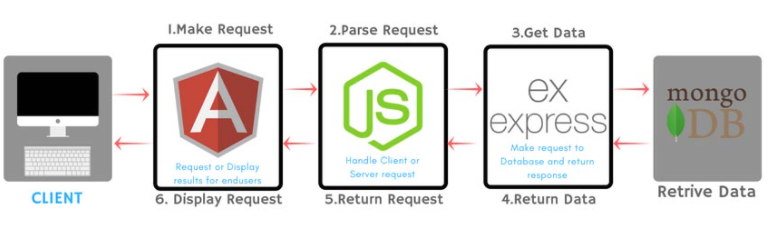
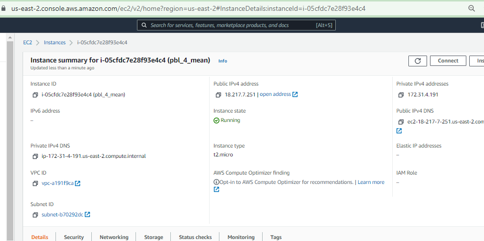
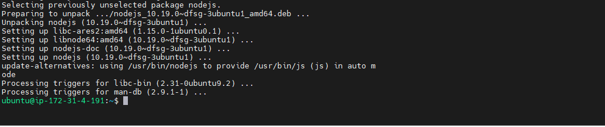

# MEAN STACK IMPLEMENTATION
### MEAN (MongoDB, ExpressJS, Angular, NodeJS)-It consists of following components:

-   MongoDB (Document database) – Stores and allows to retrieve data.
-   Express (Back-end application framework) – Makes requests to Database for Reads and Writes.
-   Angular (Front-end application framework) – Handles Client and Server Requests
-   Node.js (JavaScript runtime environment) – Accepts requests and displays results to end user

*MEAN Architecture*

#### Step 0 – Spun-off EC2 Linux Ubuntu Server and Applied basic configurations

Launched EC2 instance of Linux Ubuntu Server 20.04 LTS (HVM) and named it as pbl_p4_mean. Created security group with relevant ports opened and also created and saved my private key to be used for SSH into the EC2 instance.

*EC2 Instance Linux Ubuntu Server 20.04 1 CPU 8G Storage*

### Step 1: Install Node.js

Node.js is a JavaScript runtime built on Chrome’s V8 JavaScript engine. Node.js is used here to set up the Express routes and AngularJS controllers.

Update ubuntu

`sudo apt update`

Upgrade ubuntu

`sudo apt upgrade`

Install NodeJS

`sudo apt install -y nodejs`

*NodeJS installation completed*

